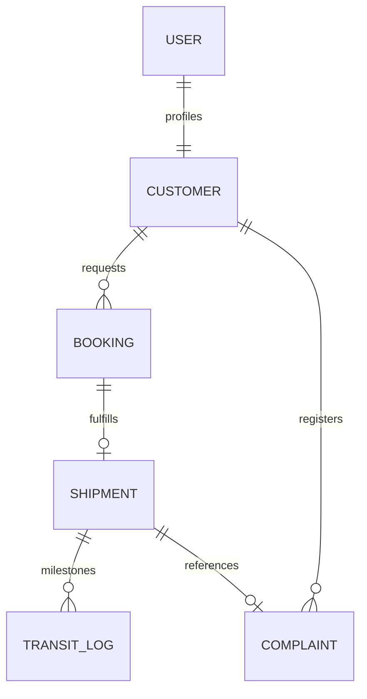

# Smart Logistics ERP - Premium Enterprise Cargo Portal

A commercial-grade, full-stack Django enterprise resource planning (ERP) system designed for freight forwarders, cargo service providers, and global shipping companies. It includes an interactive customer freight request workspace, live dimensional weight calculators, tracking logs, and a staff operations control tower.

---

## 🚀 Key Enterprise Features

1. **Volumetric Pricing Billing Engine**
   - Implements international freight standards ($\text{L} \times \text{W} \times \text{H} \, / \, 5000$) to determine dimensional cargo weight.
   - Computes base fees, weight scales, service level multipliers (Economy, Standard, Priority Express), and declared-value insurance surcharges dynamically.

2. **Operations Control Tower Dashboard**
   - High-impact operational KPI indicators (Pending Bookings, Active Shipments, Open Support Tickets, and Total Revenue).
   - Real-time Shipment Status Distribution analytics using modern gradient doughnut charts (Chart.js).

3. **Live Freight Quote Cost Estimator Widget**
   - Real-time client-side calculators inside the booking request form, allowing customers to preview estimated costs instantly before submitting requests.

4. **Chronological Milestone Tracking Timeline**
   - Step-by-step vertical visual roadmap showing precise locations, times, and transit status updates (e.g., origin terminal, linehaul convoy, customs clearance, out for delivery).

5. **Print-Ready Commercial Invoices**
   - CSS `@media print` optimized printable commercial invoices. Generates clean transaction tables, payment terms, and freight details.

6. **Premium Design System & Assets**
   - Integrated custom smart logistics hero vector digital art.
   - Customized responsive layouts built with a modern color palette, micro-animations, Outfit typography, and styled Bootstrap forms.

---

## 📊 Database Schema & ER Diagram



### Main Entities
- **Customer**: Links Django user authentication with address, telephone, and account metadata.
- **Booking**: Stores origin/destination routes, pickup schedules, detailed freight dimensions (L, W, H), cargo weight, service classes, declared values, and estimated shipping costs.
- **Shipment**: Tracks approved shipments with auto-generated tracking numbers, coordinates, and current delivery statuses.
- **TransitLog**: Captures a full historical audit trail of transit milestones for shipping routes.
- **Complaint**: The integrated customer support ticket system.

---

## 🛠️ Installation & Setup

1. **Clone and Setup Virtual Environment**:
   ```bash
   python -m venv venv
   source venv/bin/activate
   pip install -r requirements.txt
   ```

2. **Environment Variables Configuration**:
   Create a `.env` file in the root directory:
   ```env
   DJANGO_SECRET_KEY="your-secret-key"
   DJANGO_DEBUG=True
   DJANGO_USE_SQLITE=True
   ```

3. **Initialize Database and Seed Sample Data**:
   ```bash
   python manage.py migrate
   python manage.py seed_sample_data
   ```

4. **Start Development Server**:
   ```bash
   python manage.py runserver
   ```

---

## 🧪 Running Automated Tests

A comprehensive unit testing suite is provided in `portal/tests.py` to validate the volumetric weight equations, service multipliers, and automated transit logs:

```bash
python manage.py test
```

---

## 👥 Demo Logins

- **Operations Staff (Admin)**: `admin` / `admin12345`
- **Freight Customer (Client)**: `customer` / `customer12345`
